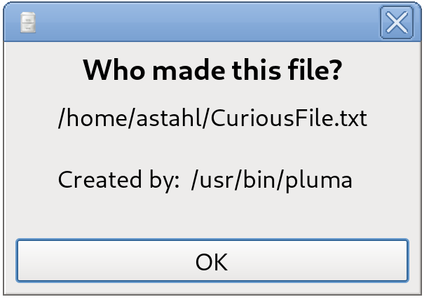

## What is whomade?

Whomade is a Linux daemon that monitors user-specified directories and records 
which process created each file. This makes it easy to later identify the origin 
of files with suspicious or unexpected names.    
The main idea was to monitor and identify files in the dot directories in the /home.

## Nuances?

Whomade uses the Linux fanotify API, which can be a bit… unusual and doesn’t 
always behave as you might expect. At present, the daemon doesn’t strictly 
detect file **creation** events. Instead, it logs processes that **access** 
files (applying some trivial filters like analyzing the age of file), which can 
sometimes lead to false positives.

While this does not make the daemon useless, it does mean that the information 
it provides should be interpreted with care — critical thinking is still 
advised when reviewing the results.

## Initial setup

Upon the first start the daemon will create the database and fill the monitor/ignore
fields with **placeholders**. You must replace them with your data. Use --help for reference how.    
Example:     
whomade --list // Will show you the current situation     
whomade --remove "copy the placeholder here"    
whomade --add "use the real path you're interested in"    

## Convenience?

I offer you an extension for the Caja FM (from MATE DE, fork of Gnome 2) where you
can just right-click on file and ask "Who made this?" from a menu.

## Dependencies?

 - libsqlite3.
