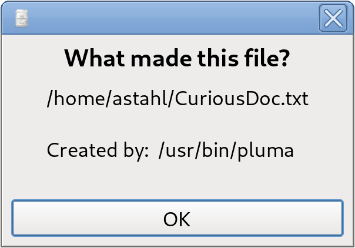

## What is whatmade?

Whatmade is a Linux daemon that monitors user-specified directories and records 
which process created each file. This makes it easy to later identify the origin 
of files with suspicious or unexpected names.    
The main idea was to monitor and identify files in the dot directories in the /home.

## Building?

```bash
  mkdir build
  cd build
  cmake ..
  make
```

## Autostart through systemd?

Copy the ./systemd/whatmade.service file to /etc/systemd/system/ and enable the service with
these commands:
```bash
sudo systemctl daemon-reload
sudo systemctl enable whatmade.service
sudo systemctl start whatmade.service
```

## Nuances?

Whatmade uses the Linux fanotify API, which can be a bit… unusual and doesn’t 
always behave as you might expect. At present, the daemon doesn’t strictly 
detect file **creation** events. Instead, it logs processes that **access** 
files (applying some trivial filters like analyzing the age of file), which can 
sometimes lead to false positives.

While this does not make the daemon useless, it does mean that the information 
it provides should be interpreted with care — critical thinking is still 
advised when reviewing the results.

This daemon stores process data in the Extended File Attributes.

## Initial setup

Upon the first start the daemon will create the config file and fill the monitor/ignore
fields with **placeholders**. You must replace them with your data. 

## Convenience?

I offer you an extension for the Caja FM (from MATE DE, fork of Gnome 2) where you
can just right-click on file and ask "What made this?" from a menu.
Put the file in ~/.local/share/caja-python/extensions and restart the Caja ("caja -q")



## Dependencies?

 - libconfig++
